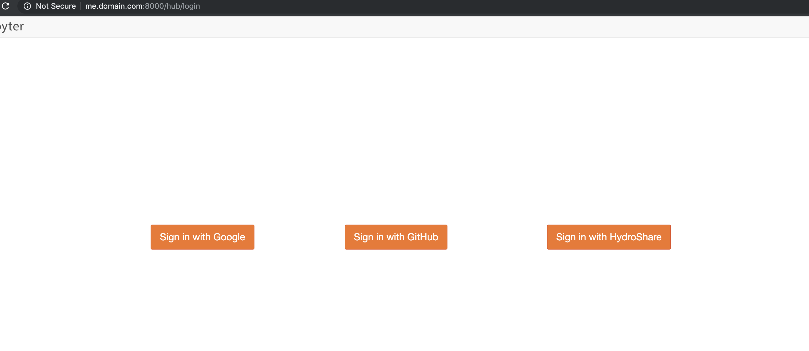

# Multi-oauthenticator demo

This is a simple example of running jupyterhub with a multi-oauthenticator
See: https://github.com/jupyterhub/oauthenticator/issues/136
Inspired by https://gist.github.com/danizen/78111676530738fcbca8d8ad87c56690

google
github
hydroshare (customized generic oauth authenticator)

